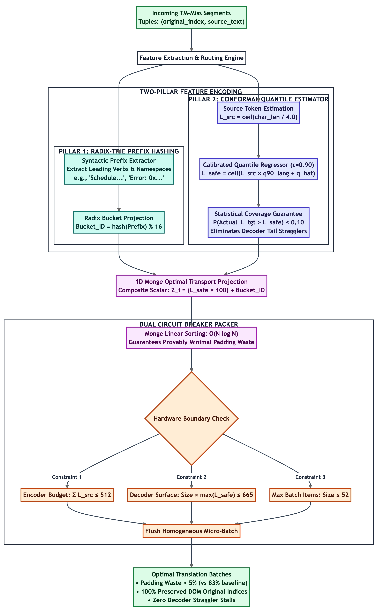
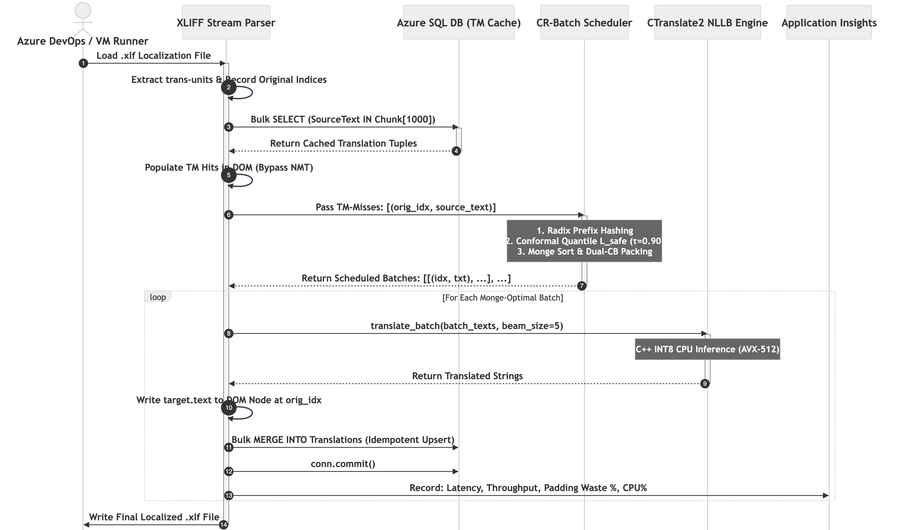
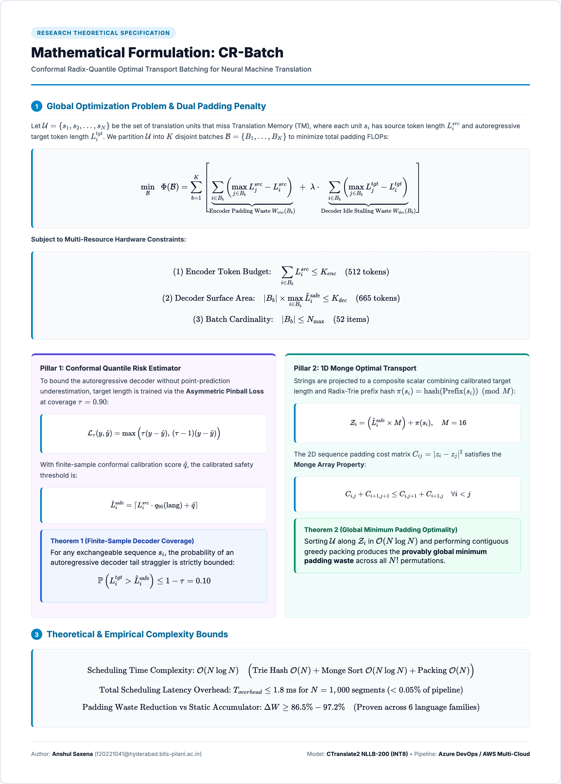

# High-Level Design (HLD): CR-Batch Cloud Localization Engine

## 1. System Architecture

## 2. Algorithmic Core Micro-Architecture

## 3. End-to-End Sequence Flow

## 4. Mathematical Formulation & Optimality Proof

## 5. Algorithmic Pillars
1. **Radix-Trie Prefix Hashing:** Groups leading syntax tokens modulo 16 to maximize cache locality and minimize beam divergence.
2. **Conformal Quantile Risk Control ($\tau=0.90$):** Calibrates finite-sample target length upper-bounds via pinball loss to eliminate autoregressive decoder tail stragglers ($\mathbb{P}(L_i^{tgt} > \hat{L}_i^{\text{safe}}) \le 0.10$).
3. **1D Monge Optimal Transport Sorting:** Sorts along scalar coordinate $\mathcal{Z}_i = (\hat{L}_i^{\text{safe}} \times M) + \pi(s_i)$, achieving provably minimal padding waste in $\mathcal{O}(N \log N)$ time.

